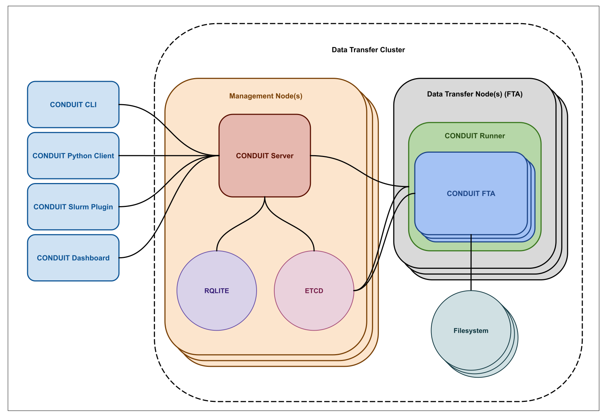

# CONDUIT

Conduit (Capacity ON Demand User Interaction Toolset) is a distributed data transfer service designed to move large datasets efficiently between storage systems in high-performance computing (HPC) environments.
It provides a client–server architecture for scheduling and executing parallel data transfer jobs across a cluster, enabling reliable and permission-aware data movement at scale.

## Table of Contents

- [Overview](#overview)
- [Installation](#installation)
- [Docker Compose Example](#docker-compose-example)
- [Documentation](#documentation)
- [Copyright](#copyright)
- [License](#license)

## Overview

Conduit is a distributed, client–server data transfer service intended for organizations that operate multiple storage tiers across their HPC environments.

HPC infrastructures often include a variety of storage systems located on different servers and backed by different filesystems. Moving large datasets reliably and efficiently between these systems requires coordination, parallel execution, and careful enforcement of access controls.

Conduit provides a unified service for scheduling, coordinating, and executing data transfer jobs across a dedicated data transfer cluster. One or more Conduit server instances operate together as a single logical control plane, while transfer work is executed in parallel on worker nodes using user-level permissions to ensure transfers respect existing filesystem access controls.

Users interact with Conduit through a gRPC API (typically via the `conduit` CLI) to submit, monitor, and manage transfer jobs. The system is designed to be extensible, allowing administrators to support different storage backends and transfer mechanisms through a plugin-based model.

## Architecture

At a high level, Conduit consists of a logically unified control plane and a set of data transfer nodes that execute transfer work in parallel.



The Conduit server coordinates transfer jobs and maintains shared system state, while transfer execution is performed on data transfer nodes running `conduit-runner` and `conduit-fta`. Supporting services provide distributed coordination and durable storage for finalized transfer records.

For a more detailed breakdown of internal components and data flows, see the [architecture documentation](docs/architecture.md).

## Installation

See the [installation documentation](docs/installation.md)

## Docker Compose Example

### Dependencies

- [docker](https://docs.docker.com/engine/install/)
- [docker-compose](https://docs.docker.com/compose/install/)
- [git](https://git-scm.com/)

### How to use

1. Clone the repository:

   ```sh
   git clone https://github.com/lanl/conduit
   cd conduit
   ```

2. Navigate to `conduit/examples/docker` and run `build.sh`. This will build all the necessary docker images and setup the necessary configuration files and keys into /etc/conduit:

   ```sh
   # create the conduit config area (this may require root privileges)
   mkdir /etc/conduit
   cd conduit/examples/docker
   ./build.sh
   ```

3. Start the services by running the `run.sh` script. This script ends with a bash terminal that's running in the `client` container:

   ```sh
   ./run.sh
   ```

4. Run an example transfer
   ```sh
   # Start a conduit transfer
   conduit cp /mnt/fs_1/foo/hello.txt /mnt/fs_2/bar/
   # Get status on all conduit transfers
   conduit status
   ```

Notes:

1. kinit is run when the `client` container is run. If you need to get a new ticket, run any kerberos commands for `testuser`. The password is `password`

   ```sh
   # kinit as testuser to get a kerberos ticket
   kinit testuser
   # enter the password for testuser which is 'password'
   Password for testuser@example.com: password
   # view kerberos ticket
   klist
   ```

## Documentation

Detailed documentation is available in the [`docs/`](./docs) directory:

## Copyright

© 2026. Triad National Security, LLC. All rights reserved.

This program was produced under U.S. Government contract 89233218CNA000001 for Los Alamos National Laboratory (LANL), which is operated by Triad National Security, LLC for the U.S. Department of Energy/National Nuclear Security Administration. All rights in the program are reserved by Triad National Security, LLC, and the U.S. Department of Energy/National Nuclear Security Administration. The Government is granted for itself and others acting on its behalf a nonexclusive, paid-up, irrevocable worldwide license in this material to reproduce, prepare. derivative works, distribute copies to the public, perform publicly and display publicly, and to permit others to do so.

## License

_This program is Open-Source under the BSD-3 License.
Redistribution and use in source and binary forms, with or without modification, are permitted provided that the following conditions are met:_

- _Redistributions of source code must retain the above copyright notice, this list of conditions and the following disclaimer._
- _Redistributions in binary form must reproduce the above copyright notice, this list of conditions and the following disclaimer in the documentation and/or other materials provided with the distribution._
- _Neither the name of the copyright holder nor the names of its contributors may be used to endorse or promote products derived from this software without specific prior written permission._

THIS SOFTWARE IS PROVIDED BY THE COPYRIGHT HOLDERS AND CONTRIBUTORS "AS IS" AND ANY EXPRESS OR IMPLIED WARRANTIES, INCLUDING, BUT NOT LIMITED TO, THE IMPLIED WARRANTIES OF MERCHANTABILITY AND FITNESS FOR A PARTICULAR PURPOSE ARE DISCLAIMED. IN NO EVENT SHALL THE COPYRIGHT HOLDER OR CONTRIBUTORS BE LIABLE FOR ANY DIRECT, INDIRECT, INCIDENTAL, SPECIAL, EXEMPLARY, OR CONSEQUENTIAL DAMAGES (INCLUDING, BUT NOT LIMITED TO, PROCUREMENT OF SUBSTITUTE GOODS OR SERVICES; LOSS OF USE, DATA, OR PROFITS; OR BUSINESS INTERRUPTION) HOWEVER CAUSED AND ON ANY THEORY OF LIABILITY, WHETHER IN CONTRACT, STRICT LIABILITY, OR TORT (INCLUDING NEGLIGENCE OR OTHERWISE) ARISING IN ANY WAY OUT OF THE USE OF THIS SOFTWARE, EVEN IF ADVISED OF THE POSSIBILITY OF SUCH DAMAGE.

LANL software release number: O5079
